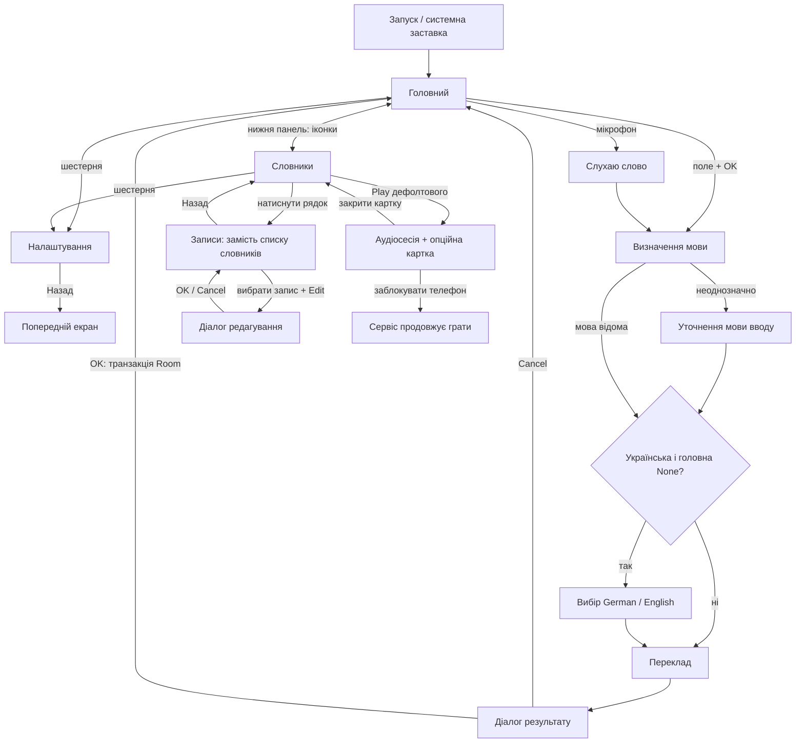
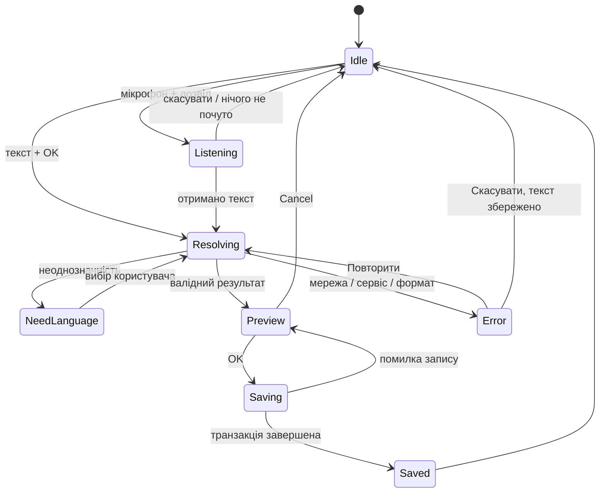
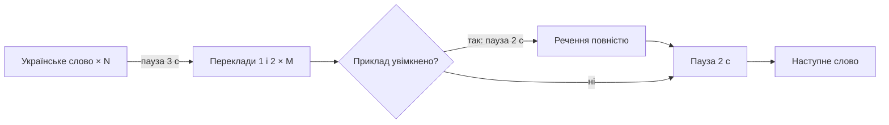
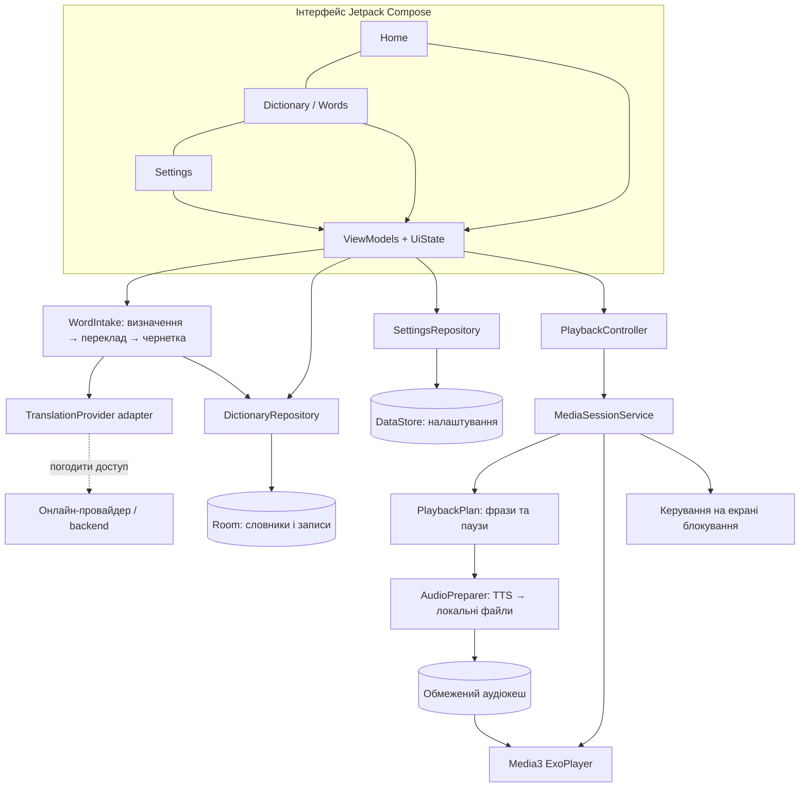
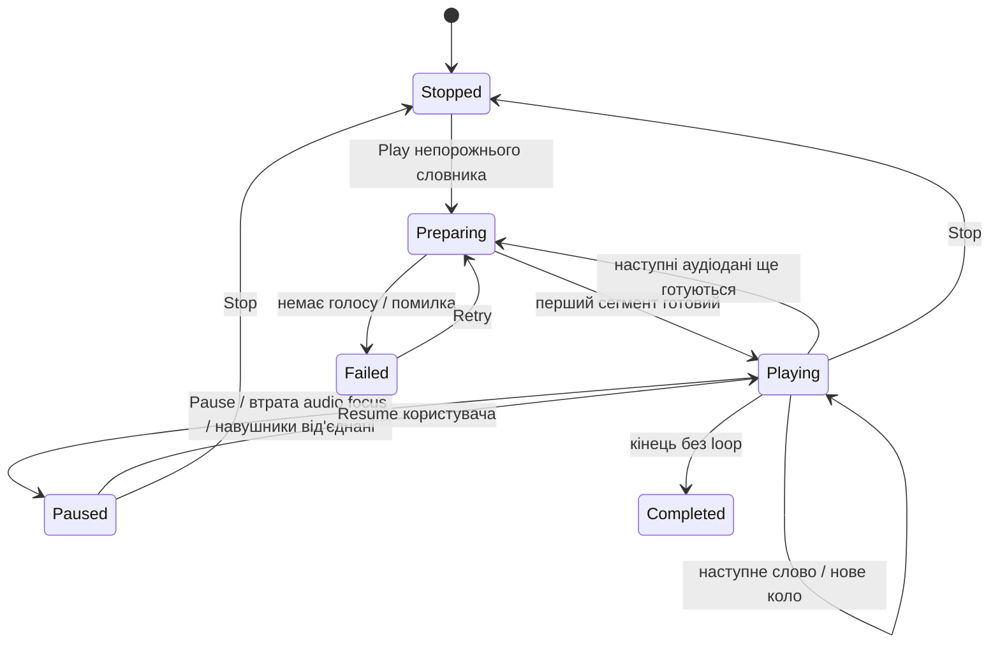
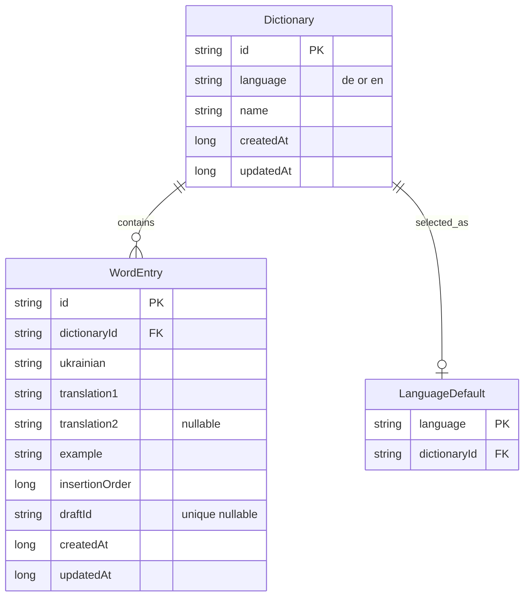

# Learn Everywhere — Software Design

Версія 1.0 · 15 вересня 2026 · **Дозволено реалізацію; A Resonance, Gemini/Firebase Spark**.

Документ описує майбутню поведінку. Kotlin-код, Android-проєкт та залежності не створюються до явного апруву. Новий порожній проєкт Stitch створений: https://stitch.withgoogle.com/projects/13006564547979315790 . Перший запит на макети відправлено; дизайн очікує генерації та перевірки. Рішення: онлайн-переклад Gemini через Firebase AI Logic на Spark без billing. Локальні дані Room; голоси Android TTS.

## 1. Задача та межі

Хочу швидко сказати або ввести незнайоме слово, перевірити переклад, зберегти до своєї колекції та слухати українське слово з німецькими або англійськими відповідниками дорогою, навіть із заблокованим екраном.

Результат після реалізації: Android-застосунок Kotlin + Jetpack Compose; локальні словники Room; голосове та текстове додавання; підтвердження перекладу; кілька словників на кожну мову; керування словами; JSON-обмін; налаштовувані аудіоуроки; англійський, український і німецький інтерфейси; світла й темна теми. Дані прикладів у макетах — демонстраційні, не історія користувача.

Зараз готуємо: два самостійні візуальні напрями, кожен у світлій і темній темах, усі екрани окремо, заставку й іконку, цей Software Design. Трактування «2 варіанти нічного та дневного режимів» — **A Light, A Dark, B Light, B Dark**. Напрям остаточно обирає користувач.

Попередній показаний проєкт не є джерелом ідей. У Stitch має бути створений новий проєкт; заборонено відкривати старі проєкти як референси, копіювати їх або використовувати готові шаблони.

## 2. Словник понять і навігація

| Поняття | Значення |
|---|---|
| Головна мова | Налаштування: None / German / English. Початково German. Впливає на український ввід і перший таб |
| Мова словника | Тільки de або en; українська завжди є мовою перекладу |
| Дефолтовий словник | Рівно один для кожної мови, якщо є хоча б один словник цієї мови |
| Слово / запис | Одне українське поле, один або два іноземні відповідники, одне іноземне речення |
| Плейлист | Той самий словник у контексті програвання, окремої сутності не створюємо |
| Чернетка | Результат перекладу перед OK, ще не запис Room |
| Черга | Незмінний знімок записів словника і параметрів на старті аудіосесії |



Нижня панель завжди має **дві** кнопки: Home та Dictionaries, тільки іконки. Settings не стає третім табом. Видимі підписи не додаємо, але всі іконки мають локалізовані назви для TalkBack, стани вибору й області натискання щонайменше 48 dp. Системний Back спершу закриває діалог, далі повертає зі слів до словників, далі до головного.

## 3. Додавання слова

### 3.1. Правила маршрутизації

| Ввід | Головна мова | Результат |
|---|---|---|
| Українська | German | Німецький дефолтовий словник |
| Українська | English | Англійський дефолтовий словник |
| Українська | None | Діалог вибору напрямку, тоді відповідний дефолтовий словник |
| Німецька | будь-яка | Німецький дефолтовий словник; один український переклад |
| Англійська | будь-яка | Англійський дефолтовий словник; один український переклад |
| Мова неоднозначна | будь-яка | Уточнення мови, без автоматичного запису |
| Не підтримується | будь-яка | Пояснення: підтримуються uk, de, en; введений текст зберігається |

Однаковий pipeline для клавіатури й мікрофона. «Головна мова» — напрямок навчання, не примусова мова розпізнавання. Кирилиця сама по собі не доводить українську; короткі латинські слова можуть належати кільком мовам. За неоднозначності або суперечливих результатів просимо обрати, а не вгадуємо.

Пропоноване уточнення суперечності брифу: «сразу записувати» означає автоматично вибрати словник; вимога OK/Cancel зберігається, фактичний запис відбувається лише після OK.

### 3.2. Формування запису

Український ввід → найуживаніший доречний іноземний відповідник + другий, лише якщо він відмінний і природний. Порядок — від найбільш доречного для вводу. Не вигадувати друге значення заради кількості. Один короткий граматичний приклад цільовою мовою, який містить перший відповідник або його природну словоформу.

Іноземний ввід → одне найкраще українське значення; перше іноземне поле зберігає нормалізоване введене слово, друге — лише якщо сервіс підтвердив доречний інший відповідник того самого українського значення; речення мовою вводу. Для багатозначного слова без контексту результат є пропозицією, яку людина перевіряє, а не гарантією єдиної правильної відповіді.

Діалог містить українське слово, обидва значення (друге приховано за відсутності), речення, мову і назву словника призначення, OK і Cancel. Після Cancel не створюємо навіть порожній автоматичний словник. При OK, якщо словників цієї мови немає, в одній транзакції створюємо «My German words» / «My English words» у поточній мові UI, призначаємо дефолтовим і додаємо запис.

### 3.3. Стан і помилки



R01.1/R18.1: порожнє поле, лише пробіли, керівні символи або понад 120 символів не відправляємо; показуємо підказку без очищення вводу. Ліміт 120 — проєктне рішення для слова чи короткого виразу.

R14.1: запит мікрофонного дозволу лише після натискання. Відмова не блокує клавіатуру. Під час слухання мікрофон стає Stop, з'являються хвиля і текст стану; тиша дає повторну спробу. Аудіо для розпізнавання не зберігаємо в Room. Конкретна доступність локального ASR залежить від пристрою; перевіряємо підтримку і показуємо явний запасний вибір мови, якщо автоматичне визначення недоступне. [Android SpeechRecognizer](https://developer.android.com/reference/android/speech/SpeechRecognizer), [RecognizerIntent](https://developer.android.com/reference/android/speech/RecognizerIntent).

R18.2: подвійний OK не дублює запис: вимикаємо кнопку під час збереження, draftId є унікальним ключем операції. Поворот екрана зберігає чернетку; після перезапуску процесу текст відновлюємо, незавершений мережевий запит не вважаємо виконаним. Якщо словник змінився після Preview, показуємо оновлене призначення та просимо знову OK.

R06.1: невалідний payload провайдера, відсутній переклад чи речення — помилка з Retry; не створюємо неповний запис. Timeout запиту 20 секунд; автоматичні платні повтори не робимо. За повторного вводу ідентичного слова у тому самому словнику показуємо існуючий запис та можливість скасувати або свідомо додати окремий; мовчки не перезаписуємо.

## 4. Екрани й поведінка бібліотеки

| Екран | Компонування і керування | Порожні / службові стани |
|---|---|---|
| Заставка | Знак програми на суцільному фоні, світлий/темний варіант; швидкий перехід до Home | Без штучного очікування або фальшивого прогресу |
| Home | Невеликий бренд, шестерня справа; центральний мікрофон 112–128 dp із делікатною хвилею; коротка підказка; текстове поле з OK; компактний підпис напрямку; внизу дві іконки | Listening, Processing, Retry, підтвердження збереження; жодної вигаданої статистики |
| Словники | Прапорні таби; велика картка дефолтового словника з Play; далі виразні компактні рядки колекцій з назвою, кількістю записів та radio; кнопка створення і JSON-дії | «Ще немає словників», Create / Import; Play disabled для порожнього словника |
| Записи словника | Замість списку колекцій; Back + назва; зверху чотири окремі іконки: Delete dictionary, Rename, Delete selected, Edit selected | Останні дві вимкнені без вибору; один вибраний запис; довгий текст переноситься |
| Картка запису | Українське слово як заголовок, під ним два нумеровані відповідники; речення окремим спокійним блоком | Якщо translation2 відсутній — не залишати порожню другу строку |
| Редагування | Невеликий діалог: українське поле, translation1, translation2 optional, example; OK / Cancel | Обов'язкові поля не порожні; Cancel не змінює Room |
| Створення / Rename | Назва словника + OK / Cancel | 1–60 символів після trim; однакові назви в одній мові не приймаємо без уточнення |
| Налаштування | Мова навчання, мова інтерфейсу, зовнішній вигляд, програвання; вертикальний preview послідовності; часові значення в секундах | Усі зміни одразу збережені; помилка сховища показується, не удаємо успіх |
| Програвання | Опційна картка повного слова, стадія вимови, номер слова, Pause / Resume / Stop | При showCard=false лишаються компактне керування і системне повідомлення |
| JSON Import | Системний вибір файлу → перевірка → підсумок імпорту → підтвердження | Помилки з номерами записів; Cancel не змінює базу |

Першим та активним табом при вході до бібліотеки є головна мова; за None — German. Якщо mainLanguage=en, порядок en, de; інакше de, en. Перемикання табів не дублює реалізацію екрана: та сама композиція з іншим language. Прапори є видимими назвами табів, для доступності — «German» і «English». Початковий ескіз використовує 🇩🇪 і 🇬🇧, це позначки мов, не фільтри країн.

Дефолтовий словник стоїть першим, має badge «Default», його назва повторюється в плеєрному хедері. Решта — за датою створення. Radio змінює дефолтовий словник, натискання тіла рядка відкриває записи; ці дві області не конфліктують. У деталях хедер відтворення чітко підписаний ім'ям **дефолтового** словника, навіть якщо переглядається інший, щоб Play не обіцяв неправильний вміст.

R50.1: Delete dictionary показує назву і число записів та потребує окремого підтвердження; Cancel нічого не видаляє. Якщо видаляється дефолтовий, найстаріший інший словник цієї мови стає дефолтовим в одній транзакції. Якщо це останній — залишається порожній стан; новий автоматично створиться при наступному підтвердженому додаванні. Словники іншої мови не змінюються. Delete selected стосується одного явно вибраного запису і має підтвердження. При видаленні словника поточної сесії спочатку зупиняємо її після підтвердження видалення. Редагування інших слів під час сесії вплине на наступний запуск, поточна черга стабільна.

## 5. Налаштування й аудіопослідовність

| Поле | Початкове значення | Допустимі значення |
|---|---|---|
| mainLanguage | German | None / German / English |
| interfaceLanguage | English | Ukrainian / English / German |
| loop | false — припущення | checkbox |
| shuffle | false — припущення | checkbox |
| ukrainianRepeats | 1 — у брифі кількість не визначена | 1–6 |
| ukrainianRepeatPauseSeconds | 2 | 1–6 секунд |
| beforeTranslationSeconds | 3 | 1–6 секунд |
| translationRepeats | 2 | 1–6 |
| translationRepeatPauseSeconds | 2 | 1–6 секунд |
| beforeExampleSeconds | 2 | 1–6 секунд |
| afterWordSeconds | 2 | 1–6 секунд |
| includeExample | false | checkbox |
| showCard | true | checkbox |
| themeMode | System — пропозиція A01 | System / Light / Dark |

«2 секунди — приклад» трактуємо як **паузу перед реченням**, а не обрізання його звучання до двох секунд. Речення промовляється повністю один раз. Усі числові налаштування мають явні одиниці, вибір 1–6, без введення негативних або дробових значень. Наступна послідовність є частиною погодження.



Між українськими повтореннями — 2 с; після останнього українського повтору лише beforeTranslationSeconds, без додаткової повторної паузи. Один цикл перекладу — translation1, пауза translationRepeatPauseSeconds, translation2, якщо він є. Далі між циклами та сама пауза. Після останнього циклу нема додаткової repeatPause: тільки beforeExampleSeconds, якщо приклад увімкнено, або afterWordSeconds, якщо вимкнено. Приклад вимкнено — його текст і його пауза повністю вилучаються. Пауза відлічується **після завершення вимови**, не після її старту. За одним відповідником звучить тільки він. За останнім словом: без loop — завершення без зайвої паузи; з loop — afterWordSeconds і нове коло.

При стандартних налаштуваннях без прикладу та з одним перекладом: українське слово → 3 с → translation1 → 2 с → translation1 → 2 с → наступне слово.

Shuffle — випадкова перестановка повного списку: кожен запис один раз на коло, не незалежний random на кожному кроці. Loop + shuffle створює нову перестановку на наступному колі; якщо слів більше одного, уникаємо повтору останнього слова на межі кіл. Звичайний порядок — insertionOrder, стабільний при перезапуску.

Усі параметри зберігаються в DataStore і відновлюються при запуску; мова UI застосовується до всіх текстів, діалогів, помилок, описів іконок і системного повідомлення, незалежно від мов навчання. Поточна сесія використовує знімок аудіопараметрів на старті; UI повідомляє «Зміни аудіо застосуються з наступного запуску». showCard і тема застосовуються відразу. Призначені користувачем назви словників не перекладаємо при зміні UI. Для простих налаштувань DataStore відділений від реляційної бази. [Android DataStore](https://developer.android.com/topic/libraries/architecture/datastore).

R38 — пропозиції: A01 → R55/R38 — System/Light/Dark потрібні для використання двох тем; включаємо у проєкт. A02 → R38 — вибір і перевірка голосу uk/de/en та швидкість мовлення 0.75×/1×/1.25×: **лише пропозиція**, не включати у розробку без погодження. Рейтинг, streaks, push-нагадування, підписки не додаються.

## 6. Архітектура

Пропозиція: один Gradle app-модуль з логічними пакетами, а не багато дрібних модулів. MVVM для екранів; Repository для локальних даних; Adapter для провайдера перекладу і TTS; окремий планувальник аудіопослідовності. Це ізолює змінні зовнішні системи та дозволяє читати основний сценарій без складних конструкцій. Use case потрібен там, де координуються кілька правил — підготувати слово, підтвердити додавання, імпортувати словник, сформувати урок; окремий клас на кожний getter не створюємо.



UI показує immutable UiState і надсилає події; ViewModel не утримує Activity і не керує життям фонового плеєра. Room — єдине джерело словникових даних, спостереження через Flow; корутини для асинхронної роботи, CPU/IO не блокують головний потік. Залежності передаємо конструкторами через невеликий composition root; DI-фреймворк не додаємо без потреби.

Аудіо: попередньо синтезувати потрібні фрази в локальні файли, програвати їх через ExoPlayer разом із сегментами тиші. Так Pause/Resume стосується і вимови, і паузи, а не лише UI-таймера. Кеш ключується текстом, мовою, voiceId та швидкістю; запис через temp + atomic rename. Підготовка першого слова перед стартом, наступних — наперед обмеженим вікном. Кеш пропонується 100 MB з видаленням найдавнішого неактивного; активні файли не видаляються. Це проєктний ліміт, не обіцянка точної кількості слів. Немає голосу або синтез не вдався — пояснення з дією налаштувати голос / повторити; не мовчазний пропуск слова. `TextToSpeech.synthesizeToFile` та callbacks використовуються як платформа для підготовки. [Android TextToSpeech](https://developer.android.com/reference/android/speech/tts/TextToSpeech).

Фоновий плеєр і MediaSession живуть у MediaSessionService; UI взаємодіє через MediaController. Передбачаються mediaPlayback foreground-service type, належні дозволи та системне media-повідомлення. Життя сесії відділене від Activity: блокування й перехід в іншу програму не зупиняють звук. [Android background playback](https://developer.android.com/media/media3/session/background-playback).



При audio focus interruption — пауза, без несподіваного самостійного відновлення; при від'єднанні навушників — пауза. Блокування екрана не є втратою фокусу. Force stop чи перезавантаження завершують сесію; після відкриття запуск користувачем починає нову чергу. Додаткове відновлення позиції між перезапусками не входить у цей бриф. Коректність із вимкненим екраном обов'язково перевіряється на реальному пристрої, не лише UI-тестом.

## 7. Дані і цілісність



`LanguageDefault` має лише два можливі ключі — de, en; тому фізично не може бути двох дефолтових однієї мови. Складений зовнішній ключ `(dictionaryId, language)` посилається на унікальну пару `(id, language)` словника, щоб de не вказував на en. `WordEntry.dictionaryId` має індекс і cascade deletion; усі related-read і транзакційні правила перебувають у repository. Room не зберігає прямі посилання Kotlin-об'єктів як зв'язки: використовуємо ключі і вибірки. [Room relationships](https://developer.android.com/training/data-storage/room/relationships).

Інваріанти: (1) якщо словників мови >0 — один default; (2) default належить своїй мові; (3) word має існуючий dictionary; (4) ukrainian/translation1/example непорожні; (5) translation2 або null, або непорожній відмінний відповідник; (6) порядок стабільний, із tie-break за id. Створення/перемикання/видалення default — Room transaction. На запуску перевіряємо та відновлюємо default для старих/мігрованих даних, не очищаємо базу. Міграції версій — явні, без destructive fallback.

Текст — Unicode; trim і нормалізація для порівняння окремо від збереженого написання, щоб не втрачати регістр німецьких іменників. Довжини: українське й кожен переклад до 120 символів, приклад до 500. Великий список використовує LazyColumn зі stable keys, DAO читає сторінки для тисяч записів; не втягуємо повну бібліотеку в кожну recomposition.

Налаштування з §5 зберігаються окремо, timestamps — epoch milliseconds. Назви й тексти не потрапляють у діагностичні логи. Аудіокеш є відновлюваним, а Room — цінними даними користувача. Автоматичного хмарного обміну бібліотекою не вводимо; політику Android backup треба явно встановити під час реалізації, початкове проєктне рішення — не вивантажувати словники в cloud backup без окремо узгодженого сценарію.

## 8. JSON-імпорт та експорт

Один файл — один або кілька словників. Обмін через системний файловий вибір Android: export CreateDocument, import OpenDocument. Не просимо доступу до всього сховища.

```json
{
  "schemaVersion": 1,
  "dictionaries": [
    {
      "language": "de",
      "name": "Demo German",
      "isDefault": true,
      "words": [
        {
          "ukrainian": "яблуко",
          "translation1": "der Apfel",
          "translation2": null,
          "example": "Ich esse einen Apfel."
        }
      ]
    }
  ]
}
```

Це приклад контракту, не особисті дані. Порядок масиву words стає insertionOrder; внутрішні UUID, draftId, кеш, ключі доступу та налаштування не експортуються. Експорт із бібліотеки дозволяє вибрати один або всі словники; формує узгоджений знімок. Другий переклад приймає null або відсутнє поле. Невідому schemaVersion відхиляємо до запису, підтримуємо uk-текст, але language тільки de/en.

Імпорт: спершу прочитати і перевірити весь файл, показати кількість словників/слів і конфлікти, потім одна транзакція. Початкові захисні межі: 10 MiB / 100 словників / 10 000 записів загалом; перевищення дає зрозуміле повідомлення і пропозицію розділити файл, не частковий імпорт. Недопустимий запис зупиняє імпорт із номером та полем. Повторний імпорт не перезаписує дані: створює нові словники з суфіксом «(import 2)» тощо та показує це перед підтвердженням. Якщо default існує — він зберігається; прапор із файлу застосовуємо лише коли відповідна мова ще не має default. Кілька isDefault=true для однієї мови — явна помилка файлу. Без прапора і без існуючого default — перший імпортований словник мови. Скасування файлопікера, помилка диска або валідації залишають базу без змін.

## 9. Межі компонентів і контракти

Це проєктні сигнатури, не створений код.

| Компонент | Володіє | Публічний контракт | Приховує |
|---|---|---|---|
| WordIntake | маршрутизація та чернетка | prepare(text, sourceHint?, targetLanguage?) → NeedSource / NeedTarget / Draft / Failure; confirm(draft) → Saved / DestinationChanged / Failure | normalisation, узгодження результатів, повторний submit |
| TranslationProvider | інтеграція перекладу | translate(text, source, target) → ukrainian, translation1, translation2?, example | провайдер, HTTP, parsing, auth |
| DictionaryRepository | Room і default | observeDictionaries(language); observeWords(dictionaryId); create; rename; setDefault; saveWord; updateWord; deleteWord; deleteDictionary | DAO, транзакції, FK, міграції |
| DictionaryTransfer | формат JSON | previewImport(stream) → ValidatedImport / Errors; commitImport(validated) → Summary; export(ids, stream) | version parser, ліміти, naming conflicts |
| SettingsRepository | налаштування | observeSettings() → Flow; update(settings) → Saved / Failure | DataStore schema і defaults |
| PlaybackPlan | порядок вимови | create(words, settings, randomSeed) → список Speak(text, language, wordId) / Silence(durationMs, wordId) | repetitions, shuffle, loop boundary |
| AudioPreparer | синтез і кеш | prepare(phrase, voice) → LocalAudio / MissingVoice / Failure | TextToSpeech callback, temp files, кеш |
| PlaybackController | керування сесією | play(defaultDictionaryId); pause; resume; stop; observeState | MediaController transport |
| PlaybackService | життєвий цикл звуку | MediaSession commands + session state | Player, audio focus, notification, знімок черги |

Перевірки концентруємо на WordIntake + DictionaryRepository для бізнес-правил і PlaybackPlan для таймінгів. Не тестуємо приватні методи заради покриття. Окремі платформні сценарії — Room instrumentation, MediaSession і Compose UI.

Обрано Gemini через Firebase AI Logic. Нижче наведено обґрунтування ізоляції провайдера; актуальна інтеграція описана у §18. Для онлайн-варіанта клієнт не повинен містити сервісний секрет у APK; якщо потрібен секретний ключ, необхідний погоджений backend/proxy з авторизацією і лімітами. Для публічного мобільного API допустимий лише його документований mobile-auth механізм. Ціну, акаунт і хостинг не вигадуємо; не реалізовуємо фальшивий production-переклад локальною таблицею. Для повністю офлайн-варіанта окремо перевіряються мовні моделі, ліцензії, розмір і якість двох значень та речень; це суттєва архітектурна розвилка.

## 10. Самостійний дизайн: два напрями для Stitch

**A — Resonance.** Спокійний «аудіоінструмент»: тепле світле полотно, графітова типографіка, глибокий бірюзовий акцент; у темі Dark — чорнильний фон і світла м'ята. Центральний мікрофон оточений одним тонким кільцем хвилі, що відображає справжній стан слухання. Словники — вертикальні «обкладинки» з вузькою кольоровою корінцевою смугою; дефолтовий винесений у плеєрну картку. Візуальна ідея пов'язує вимову та особисту аудіоколекцію.

**B — Fieldnotes.** Більш редакційний, теплий: молочний фон, темна сливова типографіка, теракотовий акцент; Dark — темний сливовий фон і персиковий акцент. Мікрофон стоїть у простій асиметричній композиції з великою текстовою підказкою; словники нагадують акуратні індексні картки з кутовою закладкою і числом записів. Без звукових кілець A; відмінність у композиції та характері, а не лише кольорі.

Палітри — пропозиції дизайнера, не наданий користувачем бренд. Обидва напрями мають той самий набір функцій. Текст UI у макетах — English за дефолтом брифу, самі слова — uk/de/en. Немає onboarding-каруселі, реклами, соціальних стрічок, вигаданих навчальних досягнень.

Іконка: оригінальний простий знак «відкрита книга, сторінки якої стають двома звуковими дугами» з невеликою негативною play-формою посередині. Перевірити читабельність у малому розмірі, adaptive масках і монохромному Android-варіанті. Не складати три прапори або дрібні літери на іконці. Фінальний asset ще має бути створений у рамках погодженого напряму.

Заставка продовжує знак і фон теми, без додаткового фейкового loading-screen після системної заставки. Платформна реалізація має відповідати системному SplashScreen API. [Android splash screens](https://developer.android.com/develop/ui/views/launch/splash-screen).

Обов'язковий список окремих макетів для **кожного** напряму і теми: Splash, Home idle, Home listening, Translation preview, Dictionaries German, Dictionaries English, Dictionary detail із вибором, Word edit dialog, Settings (за потреби дві прокрутки), Playback card. Додаткові стани: Empty library, New/Rename dictionary, Ukrainian target chooser, Ambiguous language chooser, Import review, Error/retry, Delete confirmation. Спершу порівняти чотири ключові дошки A Light/A Dark/B Light/B Dark; після вибору — перевірити решту станів того напряму. Вимога показати всі екрани залишається до апруву, навіть якщо Stitch генерує їх кількома пакетами.

R54.1: перевірка 360 dp і великого шрифту, перенос довгого німецького слова, видимість кнопок при клавіатурі. Стандартна ціль контрасту тексту 4.5:1, великих елементів 3:1, вибір не лише кольором. Декоративний рух вимикається при системному запиті зменшення анімацій.

## 11. Приймальні сценарії після апруву і реалізації

| Вимоги | Дія користувача | Очікуваний доказ |
|---|---|---|
| R01–R08, R15–R21 | Ввести uk/de/en; окремо Gift | Правильний напрям або уточнення; до двох значень; одне речення; Cancel не записує |
| R03, R11, R47 | Створити по два словники, перемкнути default | Один default у кожній мові; він перший і в Play-хедері |
| R09, R37 | Додати запис, змінити параметри, перезапустити | Дані й параметри відновлені |
| R10 | Export → import; invalid JSON; Cancel | Round-trip збереження тексту/порядку; помилка не змінює Room |
| R12–R14, R19–R20 | Home, мікрофон без дозволу, клавіатура | Дві нижні іконки; великий мікрофон; ручний ввід працює |
| R24, R39, R41–R42 | mainLanguage=en, UI=uk | English таб перший; UI український; дані не переписані |
| R25–R35, R44 | Віртуальний годинник, різні N/M та обидва значення | Точна послідовність Speak/Silence без зайвих пауз |
| R36, R45 | showCard true/false під час сесії | Картка показується/ховається, звук не перезапускається |
| R46 | Заблокувати фізичний пристрій на 10 хв; Pause з lockscreen | Вимова й паузи тривають, керування синхронне |
| R48–R53 | Відкрити словник, вибрати, edit/cancel/delete/rename/create | Контент у тому самому екрані, усі поля доступні, DB відповідає підтвердженню |
| R54–R56, R61–R62 | Переглянути Stitch-пакет | Новий project ID; дві концепції × дві теми; усі екрани, іконка й splash |
| R57–R60 | Перевірити документи і git | Графічна архітектура; код тільки після апруву; коментарі та develop |

Тестовий набір для аудіо: один/два відповідники, N=1/6, M=1/6, includeExample on/off, порожня черга, один запис + loop, shuffle без пропусків/дублів на коло, pause в тиші, втрачений голос, force stop. Платформний smoke: Android minSdk пропонується 26; перед реалізацією зафіксувати актуальні compile/target SDK та бібліотеки, не вигадувати номери. Перевірити мінімальний і актуальний API та одну актуальну фізичну модель.

## 12. Погодження, відкриті рішення і подальша робота

**Відкрито:** завершення й перевірка макетів у новому проєкті Stitch; онлайн чи офлайн переклад; провайдер/акаунт/витрати; вибір дизайну A/B; апрув Software Design. Усі вони лишаються явними, жоден не замінений вигаданим фактом. Вибір провайдера не блокує малювання екранів, але блокує завершений інтеграційний план.

**Проєктні припущення для перегляду:** ukrainianRepeats=1, loop/shuffle=false, пауза перед прикладом 2 с, повтор обох відповідників як одного циклу, minSdk26, System theme, default після видалення — найстаріший інший, імпорт створює копії. Їх можна скоригувати до коду.

Розробка почнеться після явного повідомлення користувача про погодження готового дизайну та Software Design. До цього жодних scaffolding-комітів застосунку. Авторизовані готові коміти надсилати у `develop`; не force-push і не переписувати історію. Кожен завершений таск: реалізація субагентом, предметна перевірка, тести за зміною, коміт, push develop. Коментарі пояснюють «чому» біля default transaction, мовної неоднозначності, циклу вимови та служби; назви на кшталт defaultDictionaryId / translationRepeatPauseSeconds; без незрозумілих скорочень, абстракцій без потреби і прихованих side effects.

Поза рамками поточного брифу: облікові записи користувачів, синхронізація між пристроями, оплати, соціальні функції, магазин контенту. Жодну початкову функціональну вимогу не вилучено. Розробка всіх них очікує апруву; A02 є лише пропозицією.

## 13. Покриття маніфесту

Статус in-spec означає опис, а не завершення робіт. G2 ще не пройдено через відкриту інтеграцію.

| Вимога | Розділ |
|---|---|
| R01 | §3 |
| R02 | §3 |
| R03 | §3 |
| R04 | §3 |
| R05 | §3 |
| R06 | §3 |
| R07 | §3 |
| R08 | §3 |
| R09 | §7 |
| R10 | §8 |
| R11 | §4 |
| R12 | §3–4 |
| R13 | §3–4 |
| R14 | §3–4 |
| R15 | §3–4 |
| R16 | §3–4 |
| R17 | §3–4 |
| R18 | §3–4 |
| R19 | §3–4 |
| R20 | §3–4 |
| R21 | §3–4 |
| R22 | §4–5 |
| R23 | §4–5 |
| R24 | §4–5 |
| R25 | §4–5 |
| R26 | §4–5 |
| R27 | §4–5 |
| R28 | §4–5 |
| R29 | §4–5 |
| R30 | §4–5 |
| R31 | §4–5 |
| R32 | §4–5 |
| R33 | §4–5 |
| R34 | §4–5 |
| R35 | §4–5 |
| R36 | §4–5 |
| R37 | §4–5 |
| R38 | §4–5 |
| R39 | §4–5 |
| R40 | §4–6 |
| R41 | §4–6 |
| R42 | §4–6 |
| R43 | §4–6 |
| R44 | §4–6 |
| R45 | §4–6 |
| R46 | §4–6 |
| R47 | §4–6 |
| R48 | §4–6 |
| R49 | §4–6 |
| R50 | §4–6 |
| R51 | §4–6 |
| R52 | §4–6 |
| R53 | §4–6 |
| R54 | §10 |
| R55 | §10 |
| R56 | §10 |
| R57 | §2,6,7,9 |
| R58 | §12 |
| R59 | §6,9,12 |
| R60 | §12 |
| R61 | §1,10 |
| R62 | §1,10 |

## 14. Пауза за вказівкою користувача

2026-09-15T07:17:46+02:00 — користувач: «коли закінчишь бріф - зробишь паузу». Роботу призупинено: чернетка брифу і Software Design готова, вибір онлайн/офлайн та провайдера ще відкритий. Не запускати нові генерації чи наступні етапи без повідомлення про продовження. Розробка й надалі потребує явного апруву. G01 → цей розділ.

## 15. Продовження

2026-09-15T07:37:51+02:00 — після апруву дизайну користувач сказав «го». Пауза знята, продовження реалізації авторизовано. Попередні нотатки про паузу — історичні. Чекаємо лише продуктового вибору A/B та режиму перекладу, не повторного дозволу на розробку.

## 16. Вибраний дизайн

2026-09-15T07:39:07+02:00 — користувач обрав «A — Resonance, світла й темна». Реалізуємо A; B зберігається лише як розглянутий макет, не друга тема інтерфейсу.

## 17. Онлайн-переклад

2026-09-15T07:40:19+02:00 — користувач обрав «Онлайн-переклад; провайдера запропонуй». Офлайн-перекладач не реалізуємо. Запропонований варіант: Gemini через Firebase AI Logic Android SDK, structured JSON response schema для мовних кандидатів і запису. Потрібні Firebase app configuration та App Check; секрет Gemini не вбудовується у APK. Пропозиція очікує вибору користувача. Переклад генерує тільки запитане слово/вираз; усі словники залишаються в Room. Аудіо після збереження локальне, за наявності відповідних TTS-голосів.

Джерела: https://firebase.google.com/docs/ai-logic/get-started?platform=android ; https://firebase.google.com/docs/ai-logic/generate-structured-output?platform=android ; https://firebase.google.com/docs/ai-logic/pricing .

## 18. Остаточне рішення інтеграції

Користувач погодив Gemini через Firebase AI Logic, Firebase Spark без Cloud Billing. Платний тариф не підключати. Вибрана текстова модель `gemini-3.5-flash-lite`, Standard; free-tier на дату перевірки https://ai.google.dev/gemini-api/docs/pricing . Модель 2.5 Flash-Lite має дату вимкнення у жовтні 2026 року, тому 3.5 є підтримуваною заміною у межах погодженого безкоштовного рішення (https://firebase.google.com/docs/ai-logic/models). Назва в конфігурації, не розсіяна по UI. Якщо модель недоступна/квоту вичерпано — локалізована помилка, текст вводу збережено, Retry вручну; не автоматично перемикати на платну модель.

Firebase Android SDK `firebase-ai`, Google AI backend, структурований JSON response schema. Єдиний TranslationProvider приймає text/sourceHint/targetHint і повертає sourceCandidates (uk/de/en з оцінкою), detectedSource або неоднозначність, українське значення, до двох іноземних значень, приклад. На першому кроці може знадобитися уточнення source або target; повторний запит після вибору містить явні мови. Низька впевненість/кілька можливих мов → вибір, не автоматичне збереження. Валідатор незалежний від моделі: enum мов, непорожні обов'язкові поля, максимум два значення, довжини з §7, JSON parsing. Мовний результат — дані, ніколи інструкції застосунку.

App Check: production Play Integrity, debug provider тільки debug збірка і тестовий токен реєструється користувачем приватно, не у чаті/логах агента. Конфігурація нового Firebase Android app з package `com.learneverywhere.app`; Analytics/Firestore/Auth не потрібні для цієї версії. Сервісний Gemini key не у APK. Локальний google-services.json не комітити в публічний код; .example містить лише назви полів. Незконфігурований Firebase не блокує компіляцію або Room/JSON/програвання: provider повертає NotConfigured, явно показаний у UI, жодних fake translations. Реальний онлайн-тест ідентифікується окремо від fake provider unit tests. Налаштування акаунта є кроком доставки, а не невизначеною архітектурою.

Раніші §12/§14/§15/§17 про очікування/паузу — історичні, замінені цим рішенням і командою «го». A Light/A Dark реалізуються, B не включається в застосунок. Поточний контекст дозволяє створення необхідного безкоштовного Firebase-проєкту; прийняття нових юридичних умов або ввід credentials виконує користувач, якщо сервіс це вимагатиме.
