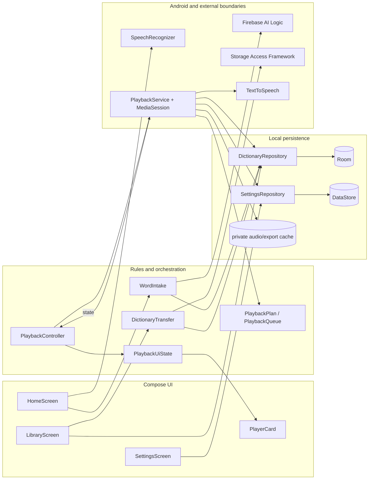
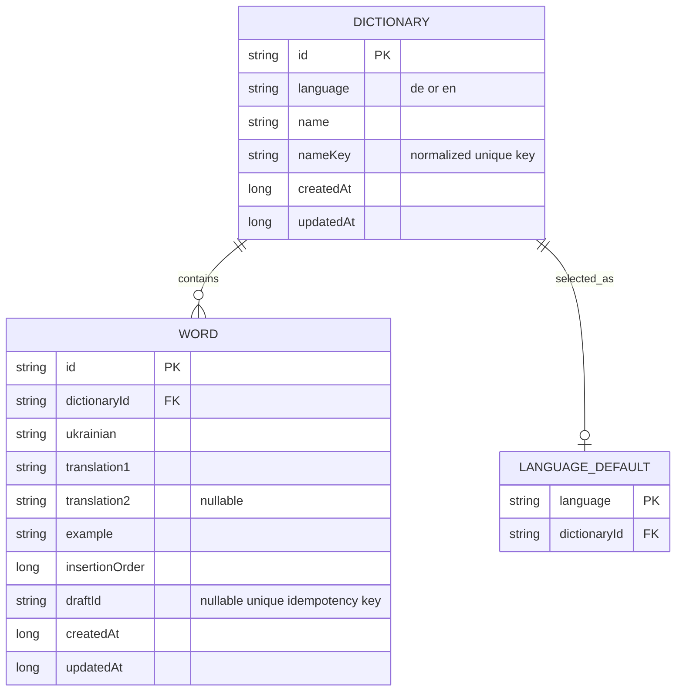
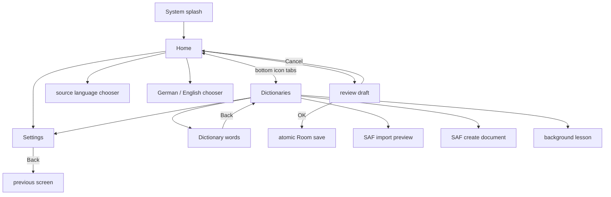
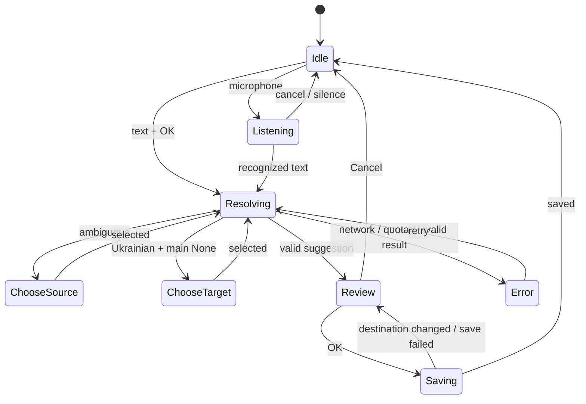
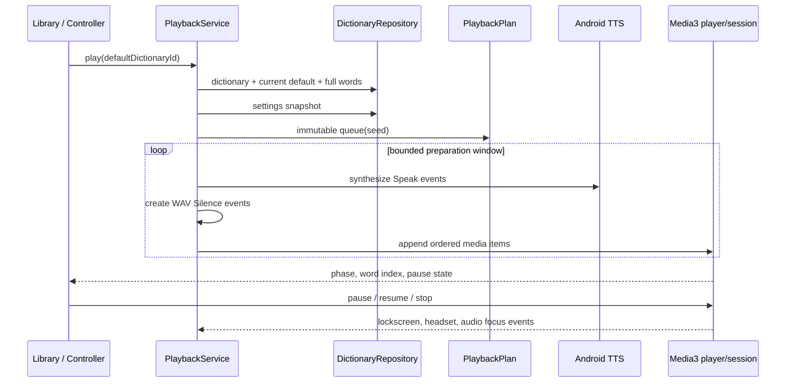

# Learn Everywhere — Software Design

## Scope and decisions

Learn Everywhere stores German and English learning dictionaries on the device. Every word has a Ukrainian value, one required foreign translation, one optional second translation, and a foreign-language example sentence. The UI uses the approved Resonance A direction in light and dark themes.

The app is Kotlin with Jetpack Compose, Room, DataStore, Firebase AI Logic, Android SpeechRecognizer, Android TTS, Media3, and a MediaSessionService. API 26 is the minimum. Firebase supplies suggestions only; the learner reviews a draft before Room is changed.

## Architecture



`MainActivity` owns top-level Home/Library navigation, the Settings overlay, theme and locale application, and the playback controller. `AppContainer` supplies process-wide repository and settings instances. UI code depends on public repositories and domain services rather than DAOs.

## Data model



Room database version 1 has foreign keys and cascade deletion. `language_defaults.language` allows at most one default per learning language. When the selected default is deleted, the oldest remaining dictionary becomes default in the same transaction. Missing legacy default rows are repaired. The builder has no destructive fallback, so a later schema version needs an explicit migration.

Dictionary names are trimmed, limited to 1–60 characters, normalized for uniqueness inside each language, and keep their display case. Word fields are trimmed; short fields are 1–120 characters, the optional second translation must differ from the first, and examples are 1–500 characters. A unique `draftId` makes repeated confirmation idempotent.

DataStore persists main language, interface language, theme, loop, shuffle, repeat counts, pauses, example inclusion, and card visibility. Numeric playback values are constrained to 1–6. `SettingsRepository.update(transform)` applies each edit to the latest stored snapshot so rapid changes to different fields do not overwrite one another.

Cloud backup and device transfer are excluded in the manifest and extraction rules. The app does not log vocabulary.

## Navigation and UI state



The bottom bar has Home and Dictionaries only. System Back closes the active dialog first, then dictionary details, then Settings or the Library tab. The Library opens the main-language tab first; None opens German. The default dictionary card remains explicit, its Play action is disabled when empty, and radio selection is separate from opening a row.

Interactive icons have localized content descriptions and Material touch targets. Home scrolls and uses IME insets; long review and edit content scrolls in bounded dialogs. Library and Settings use lazy or scrollable containers. These choices reduce clipping on small screens and with large font sizes, but device rendering still requires manual validation.

When `showCard=false`, playback keeps progress and Pause/Resume/Stop controls visible while omitting word content. Deleting a dictionary stops playback before repository deletion only when that dictionary owns the current session.

## Word intake



Keyboard and speech use the same `WordIntake.prepare` path. Input is normalized and rejected when blank, longer than 120 characters, or containing control characters. Ambiguous candidate rankings require a source choice. Ukrainian input uses the explicit target, then main language, or asks for German/English. German and English input always routes to its matching language dictionary.

`GeminiTranslationProvider` requests strict structured JSON with a 20-second timeout. `WordIntake` validates candidates, detected language, target language, normalized input, fields, sentence shape, and meaning count again. Missing or contradictory content never reaches review or Room. Provider output is a suggestion, not trusted data.

The review dialog shows all saved fields and the destination. Cancel writes nothing. If no dictionary exists, the first confirmed save creates a localized automatic dictionary and selects it as default in one Room transaction. If the default changed after review, confirmation returns `DestinationChanged` and requires another OK.

## JSON transfer

The format is UTF-8 JSON:

```json
{
  "schemaVersion": 1,
  "dictionaries": [
    {
      "language": "de",
      "name": "Travel",
      "isDefault": true,
      "words": [
        {
          "ukrainian": "квиток",
          "translation1": "Fahrkarte",
          "translation2": null,
          "example": "Ich kaufe eine Fahrkarte."
        }
      ]
    }
  ]
}
```

Room IDs, draft IDs, and timestamps are intentionally excluded. Import limits are 10 MiB, 100 dictionaries, and 10,000 words. Preview performs strict type, language, length, default, UTF-8, and duplicate-name validation without database mutation. Conflicting names become localized numbered copies. Commit sends the complete validated batch through one Room transaction. An existing default wins; otherwise the imported default flag or first imported dictionary is selected.

Export reads dictionaries, their default flags, and every ordered word in one Room read transaction. The private pending-export file survives activity recreation until the SAF destination returns, then is deleted. The app never requests broad storage permission.

## Playback



A session snapshots words and settings at start. `PlaybackPlan` emits typed `Speak` and `Silence` events and handles repeats, pauses, optional example, shuffle, loop boundaries, and avoidance of the previous word at a shuffled loop boundary. TTS and silence files are prepared in bounded batches in a private cache; active files are protected and the cache is capped at 100 MiB.

The MediaSessionService exposes notification and lockscreen transport. Audio focus loss and noisy-output events pause playback. Stop cancels preparation, clears the queue, abandons focus, releases protected files, and prevents automatic resume. Background playback, voices, OEM process behavior, and notification permission need real-device validation.

## Localization and configuration

English is the default interface language, with Ukrainian and German resources. AppCompat locale selection persists in settings and recreates resources as needed. Configuration-sensitive Compose text uses `stringResource`, `pluralStringResource`, or `LocalResources`; plural forms are localized. Theme follows System, Light, or Dark.

Firebase startup is conditional on a matching local `app/google-services.json`. Debug uses App Check debug provider and release uses Play Integrity. Configuration files and debug tokens stay outside source control.

## Verification

The acceptance command is:

```sh
JAVA_HOME="$HOME/android-studio/jbr" ./gradlew :app:assembleDebug :app:assembleRelease :app:testDebugUnitTest :app:assembleDebugAndroidTest :app:lintDebug --no-daemon
```

JVM tests cover repository transactions and persistence, default recovery, intake routing and confirmation, strict Gemini parsing, JSON limits and round trips, atomic settings updates, playback ordering/timing, bounded queue preparation, transport stop behavior, and pending export persistence. Android tests compile six Room device scenarios for defaults, transactions, persistence, cascade deletion, idempotency, and repair. Running those six tests requires a connected device or emulator.

The debug APK is `app/build/outputs/apk/debug/app-debug.apk`. The unsigned release APK is `app/build/outputs/apk/release/app-release-unsigned.apk`.

## Manual device validation

Use a clean API 26+ device or emulator and repeat core layout checks on the smallest supported phone profile and a current phone profile.

1. **Launch and navigation:** cold start in light/dark mode; verify splash has no fake delay. Open Home, Dictionaries, details, Settings, and every dialog. Exercise system Back at each layer.
2. **Text and keyboard:** set display size and font size to their largest accessibility values. Enter long valid text; verify Home scrolls above the IME, action buttons remain reachable, edit fields scroll, and no dialog clips in English, Ukrainian, or German.
3. **TalkBack:** traverse the two bottom icons, Settings, microphone/Stop, language tabs, dictionary radio buttons, playback, library actions, and selected word. Confirm localized labels, selected/disabled states, logical order, and at least 48 dp targets.
4. **Speech:** deny microphone permission and confirm text input still works. Grant it, test auto plus explicit uk/de/en recognition, Stop, Cancel, silence, and unavailable-recognizer messaging. Confirm audio is not stored.
5. **Dictionary rules:** create two dictionaries per language, change defaults, rename, edit, delete a word, cancel destructive dialogs, then delete the default and verify only the same language selects the oldest remaining dictionary.
6. **JSON via SAF:** export one and all dictionaries, rotate while the destination picker is open, import the result, review copy names and counts, cancel once, and verify malformed, oversized, unknown-version, multiple-default, and wrong-type files do not mutate Room.
7. **Settings and locale:** rapidly change different playback fields, restart, and verify all persist. Switch en/uk/de and System/Light/Dark; verify current text and plurals update without stale strings.
8. **Playback:** install Ukrainian and selected German/English TTS voices. Check exact configured repeats/pauses, second translation, optional example, shuffle, loop, card on/off, empty dictionary, missing voice, Retry, and Stop.
9. **Background controls:** during playback lock the screen, use notification and headset controls, unplug audio, interrupt with another audio app or call, and verify pause/resume/stop state. Delete a dictionary during playback and verify playback stops.
10. **Process and storage:** rotate during intake review and playback. Force-stop and relaunch; confirmed words/settings persist, unfinished network work is not treated as saved, and cache remains private.

## Manual Firebase validation

A live translation result is currently blocked by the unaccepted Gemini API Additional Terms and missing fresh `app/google-services.json`. Do not report it as passed.

After the product owner explicitly approves the terms, finish the Firebase AI Logic wizard on Spark without billing, download configuration for exactly `com.learneverywhere.app`, register the debug App Check token locally, and rebuild. On device, test one Ukrainian word with main language None, one German word while main language is English, one English word while main language is German, an ambiguous short word, a duplicate, Cancel, offline mode, timeout, invalid content, and changed-default reconfirmation. Verify the provider never writes before review and no secret or user vocabulary appears in source or logs.
